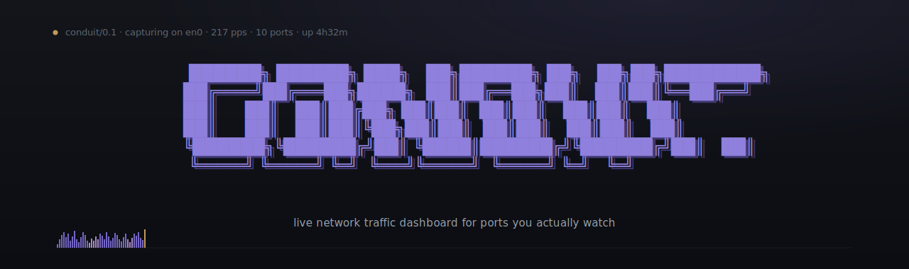

<p align="center">
  
</p>

<p align="center">
  
  
  
  
  
</p>

**A quiet, data-dense network monitor that lives on a second monitor.** Capture live packets on a Linux or macOS box, attribute them to the ports you actually care about, and watch them stream into a terminal-styled browser dashboard. No payloads inspected. No analytics. Just per-port traffic, in real time, on one page.

---

## What it does

|   |   |
|---|---|
| **Per-port live rows** | sparkline of the last 60 packets, rolling IN/OUT byte averages, requests-per-second, top source IP, total count, last-seen timestamp |
| **Auto-detected service logos** | port 80/443 → nginx, 5432 → postgres, 6379 → redis, 3000 → node, 27017 → mongo, … via [Simple Icons](https://simpleicons.org). Unknown ports just show their number. |
| **60 fps bar chart** | each new packet animates in from the right with an ease-out curve; older bars slide left, oldest falls off the edge. Queued cleanly even at high pps. |
| **Sub-second latency** | packet capture → WebSocket → canvas redraw in a single tick |
| **Live edits** | add, rename, reorder, or remove ports from the settings page — the dashboard updates without a restart |
| **Tiny** | one Node process, three static files, ~25 KB of JS, no build step |

## Quick start

```sh
git clone https://github.com/TheSolyboy/conduit.git
cd conduit
npm install
sudo node server.js
```

Open <http://localhost:4200>.

`npm install` builds a small native binding for libpcap via `node-gyp`. If it fails the cause is almost always missing `libpcap-dev` or a C toolchain — see [Prerequisites](#prerequisites).

## Configure

The fastest path is the settings page in the dashboard header — add, rename, reorder, or remove ports and they apply instantly. Or edit `config.json` directly:

```json
{
  "dashboardPort": 4200,
  "interface": null,
  "ports": [
    { "port": 22,   "name": "" },
    { "port": 80,   "name": "" },
    { "port": 5432, "name": "" }
  ]
}
```

A blank `name` triggers auto-detection — port 80 gets the nginx logo, 5432 gets the postgres logo, and so on. Type a name to override with custom text.

`interface: null` auto-picks the first non-loopback interface libpcap finds. Set it explicitly (`"eth0"`, `"en0"`, `"wlan0"`) to pin it.

Changing `dashboardPort` or `interface` requires a restart. Port list changes do not.

## Run without sudo (Linux)

Grant the Node binary the capture capabilities once:

```sh
sudo setcap cap_net_raw,cap_net_admin=eip $(readlink -f $(which node))
```

Then start with:

```sh
CONDUIT_TRY_UNPRIV=1 node server.js
```

The env var opts in to attempting capture as a non-root user. Without it, Conduit refuses up front because libpcap can crash on a failed open.

**Note**: `setcap` affects every Node process for that binary. Undo with `sudo setcap -r $(readlink -f $(which node))`.

### macOS

Either run with `sudo`, or change the `/dev/bpf*` device permissions so your user can open them — [ChmodBPF](http://wiki.wireshark.org/CaptureSetup/macOS) from the Wireshark project handles this once-and-done.

## Why elevated permissions

Conduit uses libpcap to read raw packet headers off a network interface. That's a privileged operation on every modern OS — without it you can only see traffic addressed to your own process, which defeats the purpose.

The capture loop only reads packet metadata (lengths, addresses, ports) and keeps a small per-port ring buffer. **Payloads are never inspected, stored, or logged.** The dashboard itself is unauthenticated plain HTTP — keep it bound to localhost or behind a tunnel if your machine isn't trusted.

## Prerequisites

- **Node.js ≥ 18**
- **libpcap headers** (the `cap` native addon links against them)
  - Debian/Ubuntu: `sudo apt install libpcap-dev build-essential`
  - Fedora/RHEL: `sudo dnf install libpcap-devel @development-tools`
  - macOS: `xcode-select --install`
- **`python3`, `make`, a C compiler** — for `node-gyp`. Already covered by the lines above.
- **Elevated privileges** to capture raw packets (see [Run without sudo](#run-without-sudo-linux))

Windows isn't supported. The `cap` addon needs WinPcap/Npcap plus Visual Studio Build Tools; if you're on Windows, run it in WSL2 instead.

## How it's wired

```
                 ┌─────────────┐
   libpcap ────► │  server.js  │ ──── HTTP /api/config ──► browser
                 │             │ ──── WebSocket /ws ──────► browser
                 │  • capture  │
                 │  • per-port │           ┌──────────────────┐
                 │    rings    │           │ public/index.html│
                 │  • stats    │           │ public/style.css │
                 │  • ws fan-  │           │ public/app.js    │
                 │    out      │           └──────────────────┘
                 └─────────────┘
```

Per-port state lives in the server: a ring of the last 60 packets, a 30-packet sliding window for the IN/OUT byte averages, a 5-second window for req/s, and a 30-second window for top-source attribution. The frontend doesn't compute anything except the canvas animation queue — it just renders what the server streams.

## Layout

```
conduit/
├── server.js              — HTTP + WebSocket + libpcap loop
├── config.json            — runtime configuration
├── config.example.json
├── public/
│   ├── index.html
│   ├── style.css
│   └── app.js
├── docs/
│   └── hero.svg
└── README.md
```

## License

[MIT](LICENSE).
